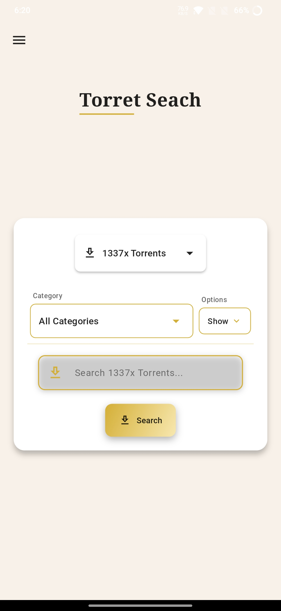
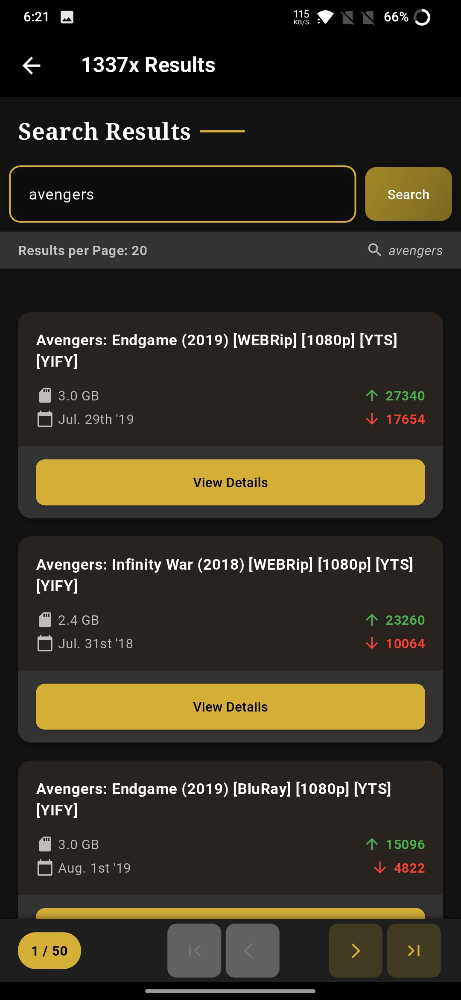
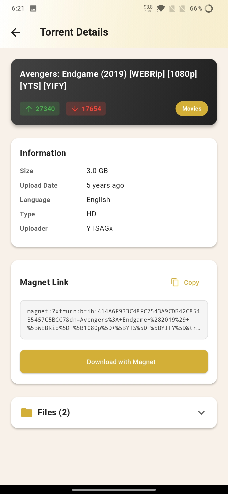

# Torret Seach

<p align="center">
  
</p>

Torret Seach is a beautiful, open-source torrent search application that provides a clean, ad-free interface to search for torrents from popular providers like 1337x and YTS.

## Features

- **Clean, Modern UI**: Elegant interface with dark mode support
- **Multiple Sources**: Search torrents from 1337x and YTS
- **No Advertisements**: Completely ad-free experience
- **Open Source**: Transparent code, available for review and contributions
- **Customizable Backend**: Connect to your own backend instance for privacy
- **Free**: No hidden costs or premium features

## Screenshots

<p align="center">
  
   
  
  
</p>

## Getting Started

### Option 1: Download the APK

1. Go to the [Releases](https://github.com/anishgowda21/torret-seach/releases) section of this repository
2. Download the latest APK file
3. Install it on your Android device (you may need to enable installation from unknown sources)
4. Open the app and connect it to a backend (see below)

### Option 2: Build from Source

1. Clone this repository

```
git clone https://github.com/anishgowda21/torret-seach.git
```

2. Navigate to the project directory

```
cd torret-seach
```

3. Install Flutter dependencies

```
flutter pub get
```

4. Build the APK

```
flutter build apk
```

5. Install on your device

```
flutter install
```

## Setting Up the Backend

Torret Seach requires a backend to function. You can easily deploy your own instance:

1. Visit the backend repository: [https://github.com/anishgowda21/torret-seach-be](https://github.com/anishgowda21/torret-seach-be)
2. Click the "Deploy to Vercel" button in the repository
3. Follow the prompts to deploy to your Vercel account (it's free!)
4. Once deployed, copy your Vercel deployment URL (e.g., https://your-app-name.vercel.app)
5. Open the Torret Seach app
6. Go to Settings and paste your backend URL
7. Save and restart the app

You're now ready to search for torrents!

## How to Use

1. **Search**: Enter your search term in the search bar and press Enter
2. **Filter**: Use the filters to narrow down results by category or sort type
3. **View Details**: Tap on any result to view more details
4. **Get Magnet Link**: From the details screen, you can copy the magnet link
5. **Change Source**: Switch between 1337x and YTS using the dropdown menu

## Privacy & Legal

This app does not track any user data. It merely provides an interface to search torrent indexing websites. The developers of this app are not responsible for the content that users search for or download.

Please use this app responsibly and be aware of the copyright laws in your country.

## Contributing

Contributions are welcome! Please feel free to submit a Pull Request.

1. Fork the repository
2. Create your feature branch (git checkout -b feature/amazing-feature)
3. Commit your changes (git commit -m 'Add some amazing feature')
4. Push to the branch (git push origin feature/amazing-feature)
5. Open a Pull Request

## License

This project is licensed under the MIT License - see the [LICENSE](LICENSE) file for details.

<p align="center">
  Made with ❤️ by <a href="https://github.com/anishgowda21">Anish Gowda</a>
</p>
